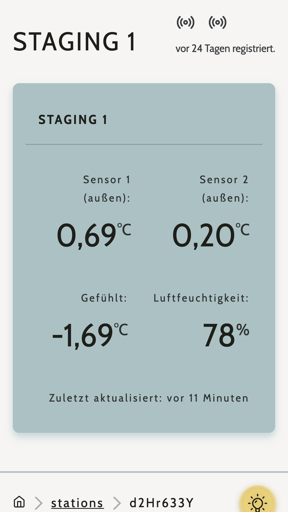
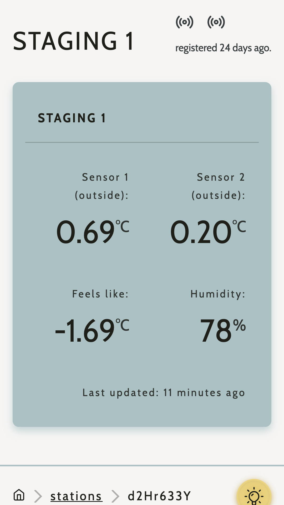
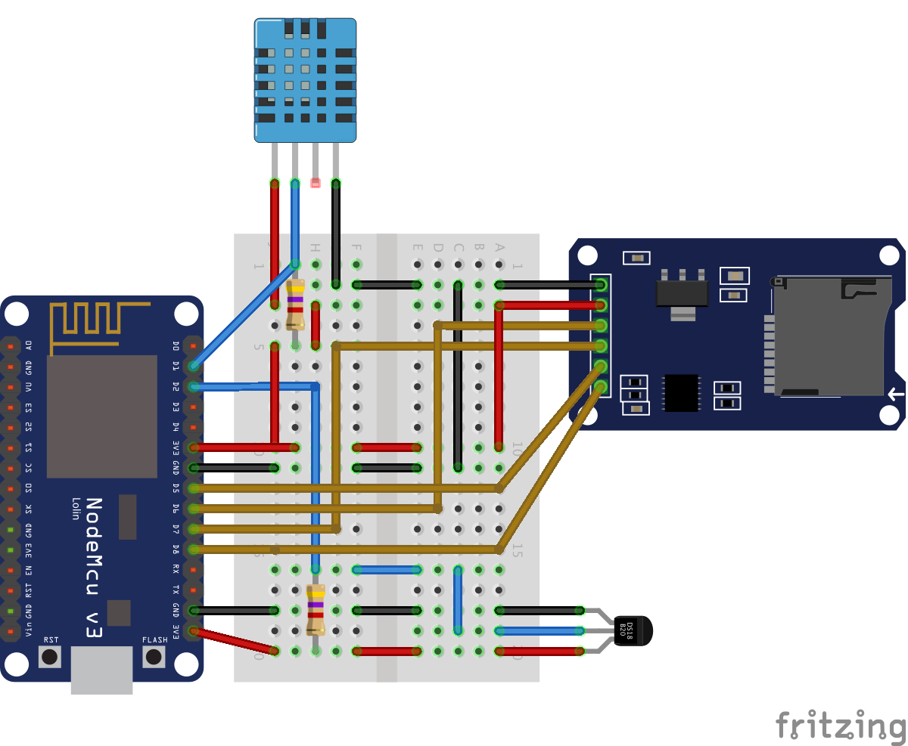

<div align="center">
  
  <br />
  <h1><a href="https://wetter.vorchdorf.media/" rel="noopener noreferrer">wetter.vorchdorf.media</a></h1>
  <strong>An Arduino-powered weather logging service. 🌡️🌤️</strong>
  <br />
  <br />
  <a href="https://app.netlify.com/sites/wetter-vorchdorf-media/deploys"></a> <a href="https://github.com/vorchdorf-dot-media/weather/actions/workflows/deploy-to-netlify.yml"></a> <a href="https://github.com/vorchdorf-dot-media/weather/actions/workflows/build-and-test.yml"></a>  
  <br />
  <br />
  <br />
</div>

## About

This repository contains the source code for [wetter.vorchdorf.media](https://wetter.vorchdorf.media), a project for recording and logging temperature data from [Arduino](https://www.arduino.cc/)-compatible microcontrollers. This project aims to stay 100% Open Source, non-profit and voluntary.

### Screenshots

<div align="center">
  
  
</div>

## Firmware

For the firmware docs (or how to setup a weather logging service), head over to the [firmware folder](firmware).

<div align="center">
  <br />
  
</div>

## Build Setup

```bash
# install dependencies
$ yarn install

# serve with hot reload at localhost:3000
$ yarn dev

# build for production and launch server
$ yarn build
$ yarn start
```

## Contribution

This is very much a hacky project and could use some formatting-, testing- and documentation love. Feel free to reach out, if you're interested.

## License

Licensed under the MIT license.

Copyright ©️ 2020 [Sascha Zarhuber](https://sascha.work)
