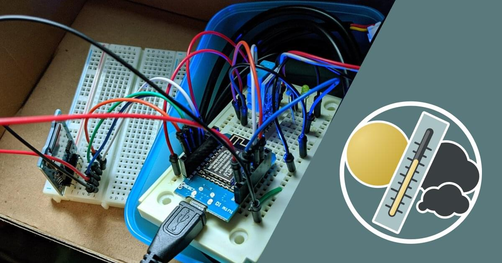
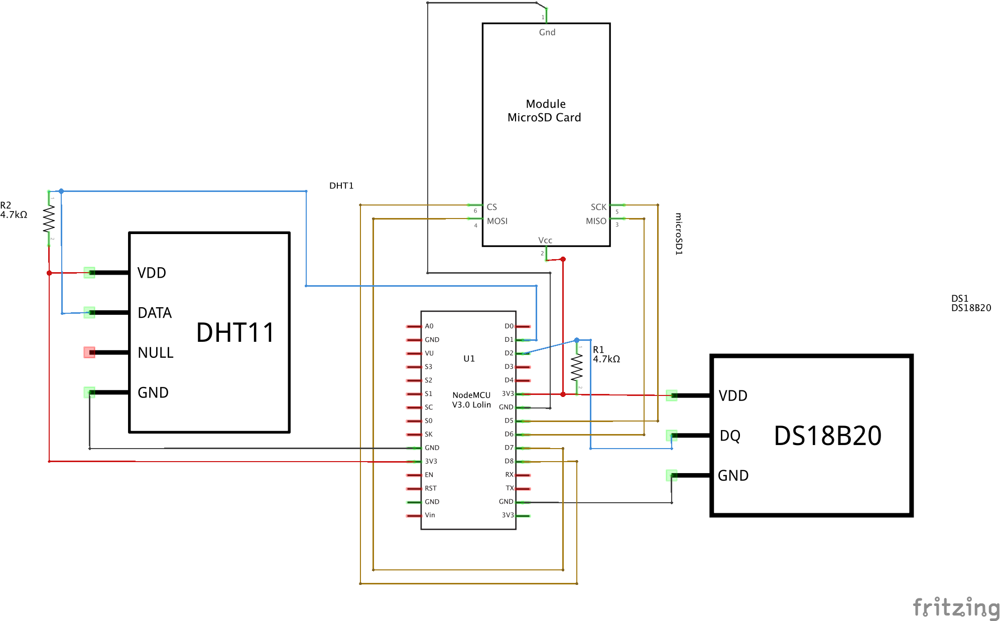
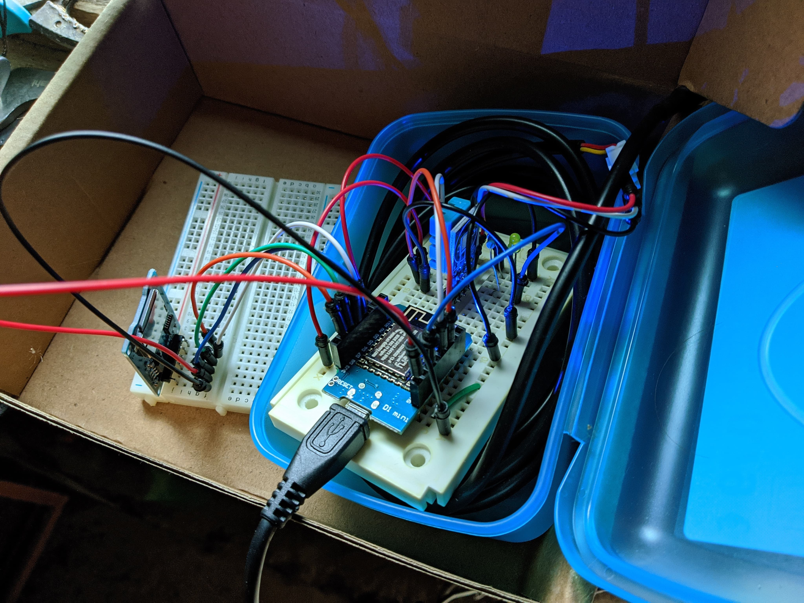
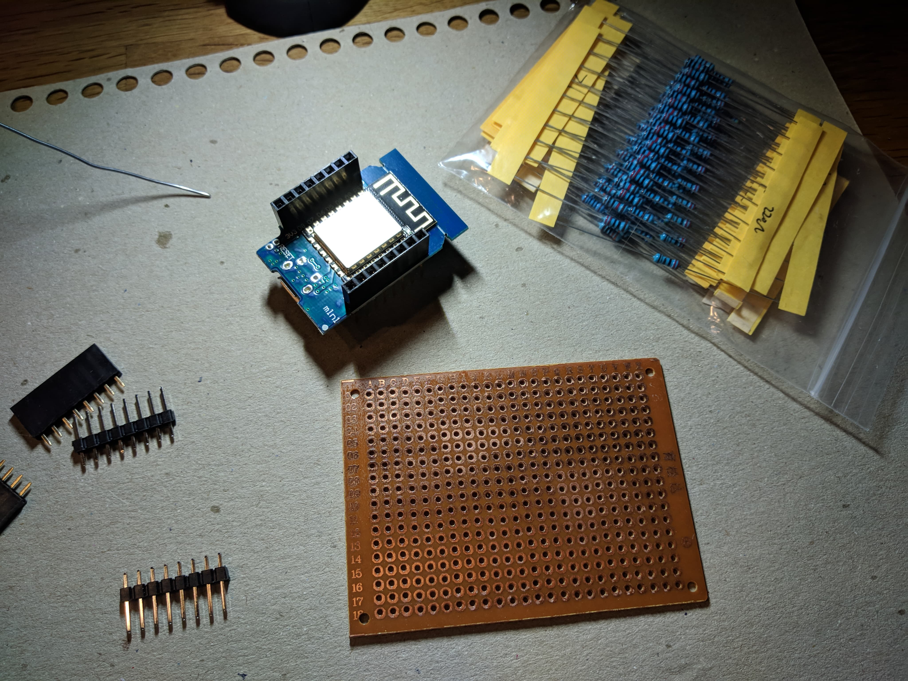
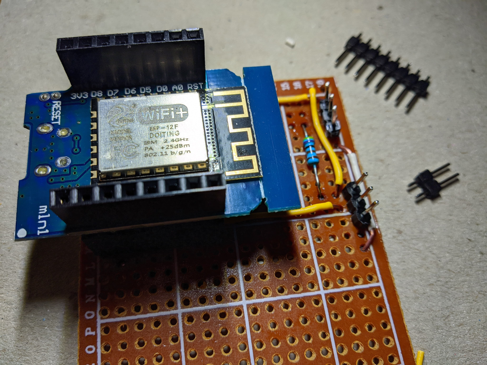
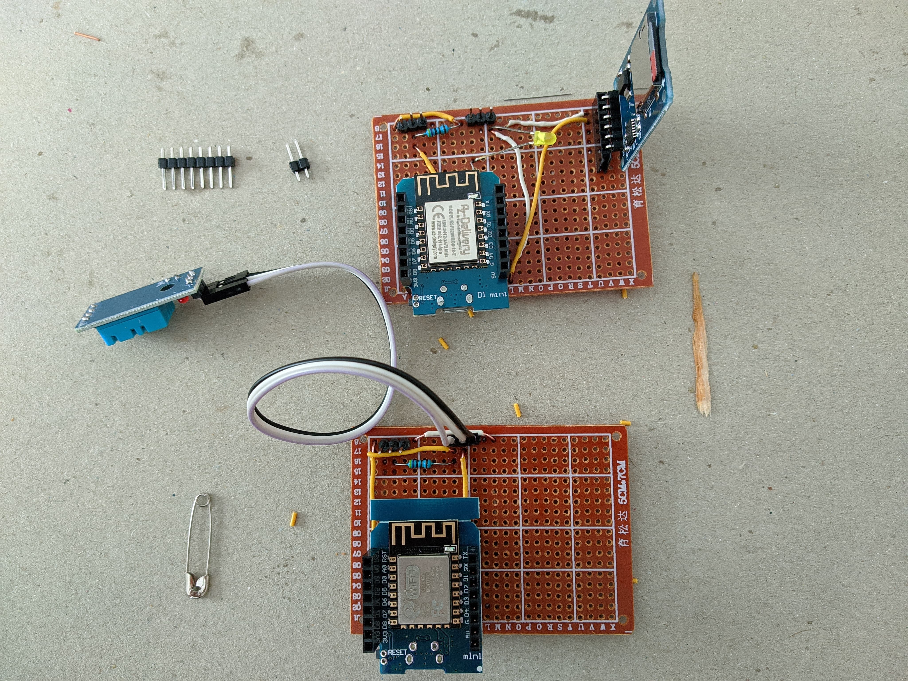

<div align="center">
  
  <br />
  <br />
</div>

# Firmware

This document should support in wiring and flashing a compatible temperature logging station.

## Preconditions

The whole setup is a combination of optional modules. The only real requirement is an Ethernet- or WIFI-enabled microcontroller, which has to be able to perform an HTTP request to the GraphQL backend for submitting the recorded temperature data.

The following table lists the necessary parts for each feature:

| Feature         | Suggested part(s)                                         | Dependencies                                        | Use                                                                | Required |
| --------------- | --------------------------------------------------------- | --------------------------------------------------- | ------------------------------------------------------------------ | -------- |
| Base module     | ESP-12, NodeMCU, D1 Mini, Arduino Ethernet Shield, etc... | -                                                   | Main interface logic                                               | ✔️       |
| Temperature     | DS18B20                                                   | 1x 4.7k resistor (Pull-up)                          | Measuring temperature                                              | ❌       |
| Temperature2    | DHT11, DHT22                                              | 1x 4.7k resistor (Pull-up, if not present on board) | Measuring temperature- & humidity                                  | ❌       |
| MicroSD Adapter | CATALEX MicroSD Adapter (SPI mode)                        | -                                                   | Writes records to SD-card as fallback, if network connection fails | ❌       |

## Wiring

The following sketches show a rough overview of how to wire the aforementioned modules together:

<div align="center">
  
  
  <br />
  <br />
</div>

## Source Code

The source code is available in the [arduino.ino](arduino/arduino.ino) file.

### Required Arduino libraries

Depending on the desired features, the following external libraries are necessary:

| Library                 | URL                                                                | Use                                                                          | Required for feature        |
| ----------------------- | ------------------------------------------------------------------ | ---------------------------------------------------------------------------- | --------------------------- |
| NTPClient               | https://github.com/arduino-libraries/NTPClient                     | Obtaining current timestamp via NTP                                          | Base module                 |
| OneWire                 | https://github.com/PaulStoffregen/OneWire                          | Interfacing OneWire-compatible parts                                         | Temperature (DS18B20)       |
| DallasTemperature       | https://github.com/milesburton/Arduino-Temperature-Control-Library | Reading temperature value                                                    | Temperature (DS18B20)       |
| DHT                     | https://github.com/adafruit/DHT-sensor-library                     | Interfacing DHT-type sensors                                                 | Temperature2 (DHT11, DHT22) |
| Adafruit Unified Sensor | https://github.com/adafruit/Adafruit_Sensor                        | Reading temperature- & humidity values, calculating 'feels-like' temperature | Temperature2 (DHT11, DHT22) |
| SdFat                   | https://github.com/earlephilhower/ESP8266SdFat                     | FAT driver for SPI-based MicroSD adapter (should already be included)        | MicroSD Adapter             |

### Configuration

The firmware may be configured by uncommenting and adapting the config section of the [arduino.ino](arduino/arduino.ino) source file.

A disabled feature may be enabled by removing the doubled forward slashes (`//`) at the start of the respective line. The following example shows, how to enable the **Temperature (DS18B20)** feature:

#### Disabled:

```C
//#define DS18B20 D2 // uncomment to enable DS18B20 data PIN
```

#### Enabled:

```C
#define DS18B20 D2 // uncomment to enable DS18B20 data PIN
```

⚠️ The correct pin has to be connected to the feature's sensor (in this case `D2`), this needs to be adapted, if a different pin layout (or completely different board) was chosen.

### Customization

Please refer to the source code (mainly the config section) for additional customizations.

## Pictures

<div align="center">
  
  
  
  
  <br />
  <br />
</div>

## Contribution

This is very much a hacky project and could use some formatting-, testing- and documentation love. Feel free to reach out, if you're interested.

## License

Licensed under the MIT license.

Copyright ©️ 2020 [Sascha Zarhuber](https://sascha.work)
